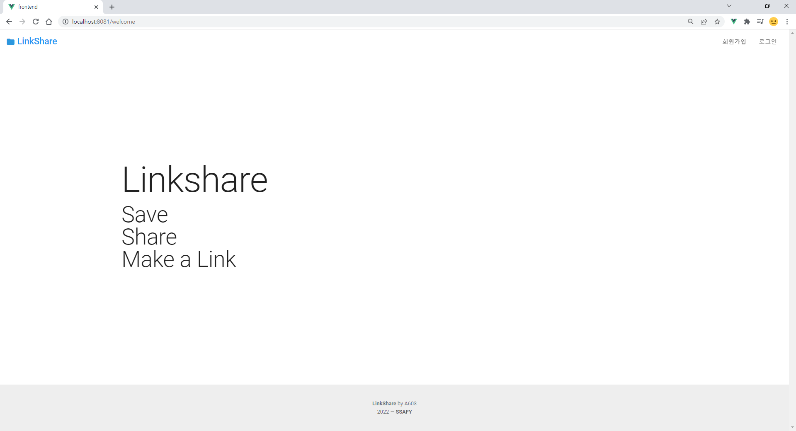
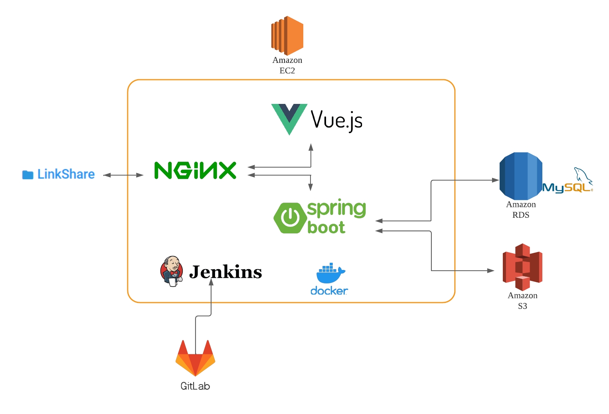

# **🖿 LinkShare ([링크](https://i6a603.p.ssafy.io/))**



**🖿 LinkShare**는 정보 저장 및 공유 SNS입니다. 제공하는 주요기능은 아래와 같습니다.

- 카테고리별 웹사이트 정보 저장 기능
- 저장한 웹사이트 공유 기능
- 웹사이트 로드맵 작성 기능

### **📑 목차**

1. [기획 배경](https://www.notion.so/readme-b6e14eed2850475ea53642d3a4b2a02b)
2. [디자인](https://www.notion.so/%EB%94%94%EC%9E%90%EC%9D%B8)
3. [주요기능](https://www.notion.so/%EC%A3%BC%EC%9A%94%EA%B8%B0%EB%8A%A5)
4. [기술 스택](https://www.notion.so/%EA%B8%B0%EC%88%A0-%EC%8A%A4%ED%83%9D)
5. [아키텍처](https://www.notion.so/%EC%95%84%ED%82%A4%ED%85%8D%EC%B2%98)
6. [파일구조](https://www.notion.so/%ED%8C%8C%EC%9D%BC%EA%B5%AC%EC%A1%B0)
7. [팀소개](https://www.notion.so/A603%ED%8C%80-%EC%86%8C%EA%B0%9C)
8. [기타 관련 정보](https://www.notion.so/%EA%B8%B0%ED%83%80-%EA%B4%80%EB%A0%A8-%EC%A0%95%EB%B3%B4)

## **💡 기획 배경**

- 참고한 사이트를 한곳에 모아 놓을 수 없을까?
  
    > 프로젝트를 진행하다보면 어느새 무한 구글링...
    > 
    > 
    > 우연히 찾은 금쪽같은 참고자료들, 나중에 또 필요할 것 같은데...
    > 
    > 도움이 된 글이나 링크를 메모랑 같이 어딘가에 모아놓을 수 없을까?
    > 
- 참고한 자료를 공유해보면 어떨까?
  
    > 눈을 감으면 떠오르는 삽질의 기억들...
    > 
    > 
    > 다른 사람들도 나와 같은 길을 걸었겠지...
    > 
    > 내가 참고한 웹사이트를 순서대로 장리해서 공유해보면 어떨까?
    > 
    > 다른 사람들이 어떻게 공부했는지도 궁금하고 의견도 나눠보고 싶어.
    > 

## **✒️ 디자인**


### **컨셉**

- **심플함** 추구해 가독성과 편의성 극대화
- 심플한 레이아웃 및 UI/UX
- 직관적인 사용법
- 테마컬러 : `#2C97DE`

### **로고**

- material design icons의 folder icon 사용
- 여러 링크정보를 한 데 모아 관리하는 컨셉이 폴더 개념과 유사해 폴더 아이콘 사용

## **⚙️ 주요기능**

- **링크박스 기능**
    - 유저가 생성할 수 있는 웹사이트 정보 모음 폴더입니다.
    - 링크박스를 생성해 내부에 링크카드를 저장할 수 있습니다. 링크박스 생성시 해당 링크박스에 대한 제목, 개요, 관심사(해시태그)를 추가할 수 있습니다.
    
    
    
- **링크카드 기능**
    - 링크카드 내부에 생성되는 개별 웹사이트 정보입니다.
    - 해당 링크에 대한 제목과 간단한 메모를 추가할 수 있습니다.
    
    
    
- **플로우차트 작성 기능**
    - 링크박스 내 링크카드로 구성된 플로우차트입니다.
    - 하나의 링크박스마다 하나의 링크트리를 생성할 수 있습니다.
    
    
    
- **링크박스 공유 기능**
    - 생성한 링크박스는 다른 유저들에게 노출되며, 좋아요, 스크랩, 댓글 기능을 통해 유저간 상호 교류가 가능합니다.
    - 좋아요 수가 많은 순으로 인기 링크박스들이 뉴스피드에 노출됩니다.
    
    
    
- **링크박스 추천 기능**
    - 프로필 화면에서 유저의 관심사를 추가할 수 있습니다.
    - 이를 바탕으로 관심사가 일치하는 링크박스들이 뉴스피드에 노출됩니다.
    
    
    

## **💻 기술 스택**

### **Frontend**

- Vue 2.6.11
- vue-cli 4.5.15

```
vue-cli, Vue, Vuex, Vue-router, Vuetify, node.js, javascript,
jwt-decode, Vue Flowy, link-prevue, vee-validate
```

### **Backend**

- Java 11 (LTS) | 11.0.14+9 | Zulu: 11.54.23
- SpringBoot 2.6.3

```
Java, SpringBoot, Gradle, JPA,
JWT, Spring Security, Spring Validation, Lombok, spring data jpa
```

### **Database**

- MySQL

### **Dev-Ops**

```
AWS EC2,AWS S3, AWS RDS, Jenkins, Docker, NginX
```

## **🔧 아키텍처**



## **🗃 파일구조**

```
📁linkshare-backend
├── 📁src
|    ├── 📁main
|    │   ├── 📁java/com/web/ls
|    │   │   ├── 📁config
|      │   │   |   └──📁security
|    │   │   ├── 📁controller
|      │   │   |   ├──📁linkbox
|    │   │   │   └──📁user
|    │   │   ├── 📁exception
|    │   │   ├── 📁model
|    │   │   │   ├── 📁dto
|    |   |   |   |   ├──📁follow
|    │   │   │   |   ├──📁linkbox
|    |   |   |   |   |  ├──📁comment
|    |   |   |   |   |  ├──📁like
|    |   |   |   |   |  ├──📁linkdetail
|    |   |   |   |   |  └──📁linktree
|    |   |   |   |   └──📁user
|    │   │   │   ├── 📁entity
|    │   │   │   ├── 📁repository
|    │   │   │   └── 📁service
|    │   │   └── MainApplication
|    │   └── 📁resources
|    └── 📁test
|
📁frontend
├── 📁public
├── 📁src
|　　├── 📁api
|　　├── 📁assets
|　　├── 📁components
│  　├── 📁comment
|    │   ├──  📁like
|    │   ├──  📁linkboxdetail
|    │   ├──  📁navigation
|    │   ├──  📁profile
|    │   ├──  📁scrap
|    │   └── 📁snsLogin
|　　├── 📁config
|　　├── 📁plugins
|　　├── 📁router
|　　├── 📁store
|　　└── 📁views
├── 📁venv
└── 📁vue-test
```

## **🥊 A603팀 소개**

- 강동원 : 팀장 & FE
- 전슬민 : FE
- 염형덕 : BE
- 정원식 : BE

## **📚 기타 관련 정보**

| 구분 |     이름     |                             링크                             |
| :--: | :----------: | :----------------------------------------------------------: |
| 기획 |   기능명세   | [노션-기능명세](https://www.notion.so/6b8e4156fb3e4b23b303ac98f8951a5c) |
| 설계 | 와이어프레임 | [노션-와이어프레임](https://www.notion.so/d51cf9775dc34efbaaad6cda8e4b0abd) |
| 설계 |     ERD      | [노션-ERD](https://www.notion.so/ERD-2d0b5413fe924e81942b44bcd2550ca8) |
| 설계 |   API docs   | [노션-API docs](https://www.notion.so/a9fdadeed2d54159b6614955a2684aed?v=014e8b4674954edd8703963c2677db54) |
| 기타 |    회의록    | [노션-회의록](https://www.notion.so/7b6c65def4ed4227854cef77d34122b4?v=7b4a4b0eee854fe29e9fc7388a41e616) |
| 기타 |     TIL      | [노션-TIL](https://www.notion.so/6001ff4742ed45ab80efa0e6a71656bd?v=6ab61aa9461148689acf3cd5318d65a6) |


